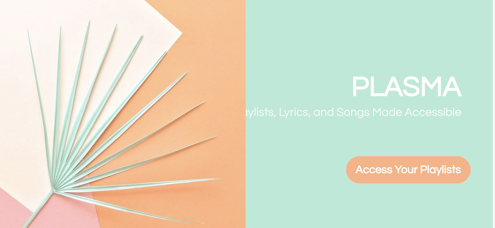
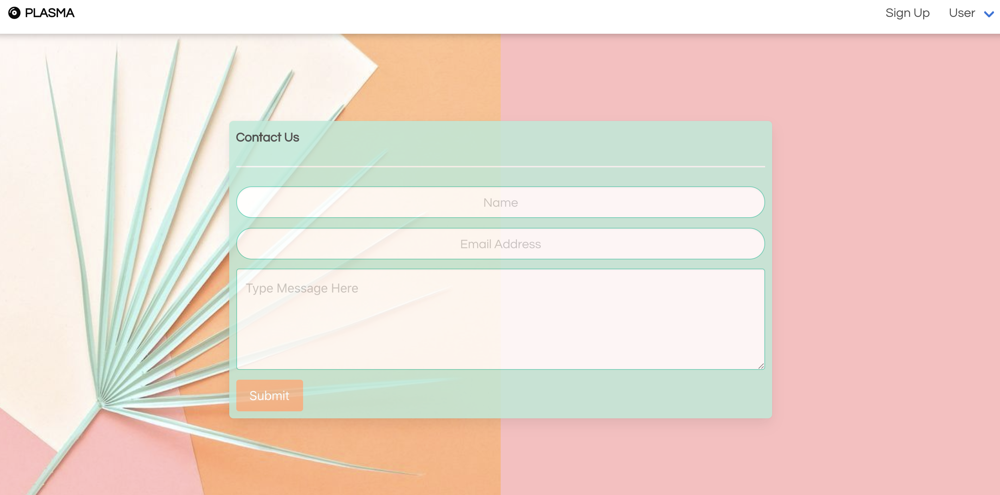
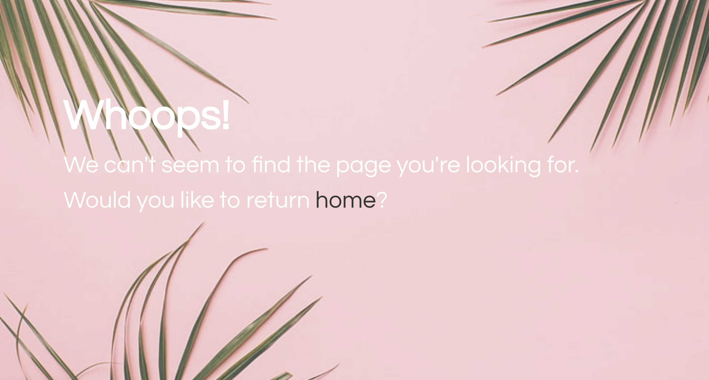
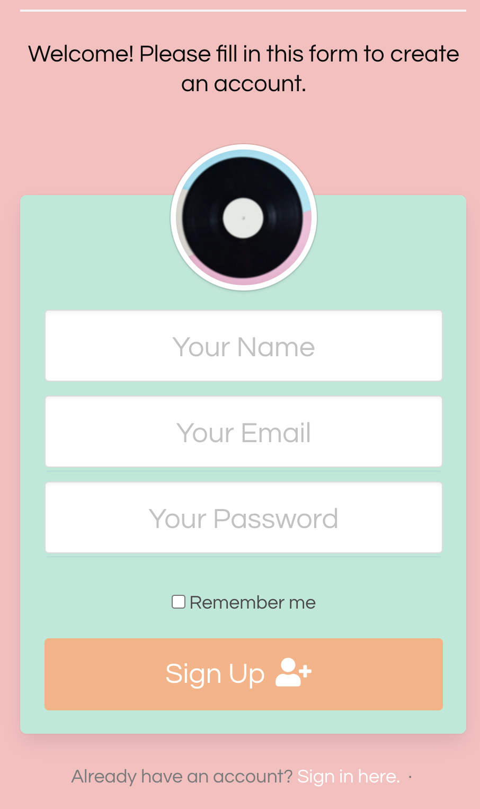

# P.L.A.S.M.A.

### Playlist Lyrics And Songs Made Accessible
___

## Description

With this application users will be able to use the secure sign up for to become a member of a community centered around creating personalized playlists.  Users will be able to select songs and artists that will create a playlist that suites the users needs. While aspects of the application are individualize per user, the user will also be able to explore new music suggestions based off playists from other users in the community.

___

## How it Works

In order for this application to work the user will need to use the terminal to run the program.  This application requires the installation of various dependencies including express, express-handlebars, mysql, and sequelize. These packages assist in handling the dashboard portion of this application.  Additional dependecies including bycrypt, passport, express-session, passort-local, and dotenv are what allow for privacy and authentication throughout the application. When the user runs "node server", there will be a listening PORT assigned to the application. For this case, PLASMA is on local host 3000. The homepage can be viewed by opening the brower to "localhost:3000" or opening the deployed Heroku link.
  

  

In order for the user to being the process of accessing the application, the user will need to click on the "Access Your Playlist" button. By doing this, an api call will be made and render the login screen. The login screen gives the user a multitude of of options to chose from. The most obvious is the option for the user to enter a username and password and select the "Login" button.  Entering in the username and password generates a session through the passport npm package.  The session is what links to the database in MySql and allows access to the rest of the application.

  

<!--  -->

  

The user also has the option select an action located at the bottom of the login page.  If the user needs assistance, he/she will be able to click on the "Need Help?" button. This will route the user to the "Contact Us" page which gives the user the ability to send a message to the developers via email. From this page, the user will be able to return to the homepage by selecting the "PLASMA" icon on the top left portion of the navigation bar, singup for membership by selecting "Sign Up" on the right side, or login/logout by making a selections from the dropdown "User" menu.

  

  

The user has another option from the login page to select the "Forgot Password" option. This will render the a 404 Error page that will then route the user back to the homepage.
  

  

The final option the user will be able to select is the "Sign Up" button.  This redirects the user to the "Signup" page where the user will be prompted to enter a name, email address, and password in order to create an account. Making a new user creates a new user in the MySql database. Each new user is assigned an id in the table. This allows for data to be populated to specific users once logged into the application.
  

  

Upon enetering the dashboard, the user will be greeted with a header that includes the specfic name he/she 

  

  

If the user wants to view the totality of the information within the application, he/she can got to localhost:8080/api/allburgers to view the details of each added burger by I.D.

  

  
___

### Links for Heroku Deployment and GitHubDeployment
 
Heroku: https://node-burgers.herokuapp.com/
  
GitHub:  https://ccraig7321.github.io/Node-Express-Handlebars/
  
Portfolio Link: https://ccraig7321.github.io/Responsive-Portfolio/

### License

Copyright 2020 CHELSEY CRAIG

Permission is hereby granted, free of charge, to any person obtaining a copy of this software and associated documentation files (the "Software"), to deal in the Software without restriction, including without limitation the rights to use, copy, modify, merge, publish, distribute, sublicense, and/or sell copies of the Software, and to permit persons to whom the Software is furnished to do so, subject to the following conditions:

The above copyright notice and this permission notice shall be included in all copies or substantial portions of the Software.

THE SOFTWARE IS PROVIDED "AS IS", WITHOUT WARRANTY OF ANY KIND, EXPRESS OR IMPLIED, INCLUDING BUT NOT LIMITED TO THE WARRANTIES OF MERCHANTABILITY, FITNESS FOR A PARTICULAR PURPOSE AND NONINFRINGEMENT. IN NO EVENT SHALL THE AUTHORS OR COPYRIGHT HOLDERS BE LIABLE FOR ANY CLAIM, DAMAGES OR OTHER LIABILITY, WHETHER IN AN ACTION OF CONTRACT, TORT OR OTHERWISE, ARISING FROM, OUT OF OR IN CONNECTION WITH THE SOFTWARE OR THE USE OR OTHER DEALINGS IN THE SOFTWARE.

___