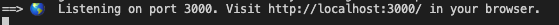
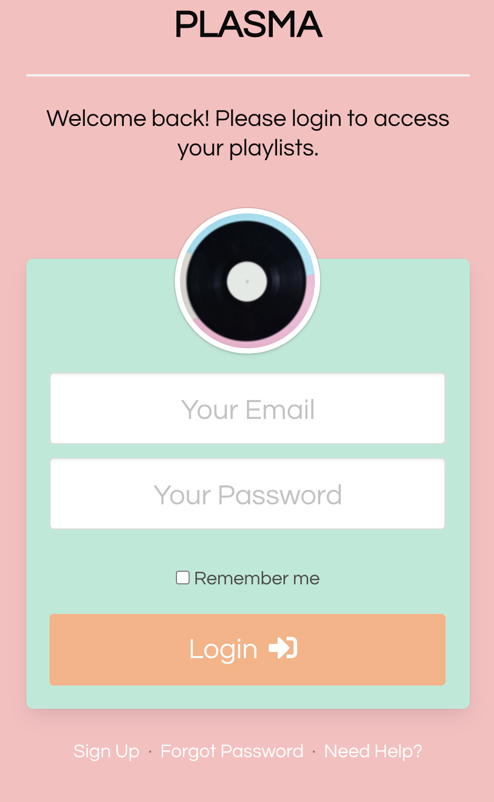

# P.L.A.S.M.A.

### Playlist Lyrics And Songs Made Accessible
___

## Description

With this application users will be able to use the secure sign up for to become a member of a community centered around creating personalized playlists.  Users will be able to select songs and artists that will create a playlist that suites the users needs. While aspects of the application are individualize per user, the user will also be able to explore new music suggestions based off playists from other users in the community.

___

## How it Works

In order for this application to work the user will need to use the terminal to run the program.  This application requires the installation of various dependencies including express, express-handlebars, mysql, and sequelize. These packages assist in handling the dashboard portion of this application.  Additional dependecies including bycrypt, passport, express-session, passort-local, and dotenv are what allow for privacy and authentication throughout the application. When the user runs "node server", there will be a listening PORT assigned to the application. For this case, PLASMA is on local host 3000.

  

  

In order for the user to being the process of accessing the application, the user will need to click on the "Access Your Playlist" button. By doing this, an api call will and render the login screen.

  

From there, the user will need to navigate over to their brower and open up the local host listen port in order to view the page.

  

  

By doing this, the user will be able to view the opening page of the application. From there, he/she will be able to enter a new name for a burger, then click on the "Make Burger" button to create the burger. 
  

  

Once clicked, the created burger will be appear on the left side of the page. Along with the newly created burger, there will be a button labeled "Eat Me!" that appears to the right of the burger name.
  

  

Once the burger is added, the user will click the "Eat Me!" button. Doing this will move the burger from the "Make the Burger" column on the left side of the page to the "DEVOUR THE BURGER!!" column on the right side of the page.
  

  

If the user wants to view the totality of the information within the application, he/she can got to localhost:8080/api/allburgers to view the details of each added burger by I.D.

  

  
___

### Links for Heroku Deployment and GitHubDeployment
 
Heroku: https://node-burgers.herokuapp.com/
  
GitHub:  https://ccraig7321.github.io/Node-Express-Handlebars/
  
Portfolio Link: https://ccraig7321.github.io/Responsive-Portfolio/

### License

Copyright 2020 CHELSEY CRAIG

Permission is hereby granted, free of charge, to any person obtaining a copy of this software and associated documentation files (the "Software"), to deal in the Software without restriction, including without limitation the rights to use, copy, modify, merge, publish, distribute, sublicense, and/or sell copies of the Software, and to permit persons to whom the Software is furnished to do so, subject to the following conditions:

The above copyright notice and this permission notice shall be included in all copies or substantial portions of the Software.

THE SOFTWARE IS PROVIDED "AS IS", WITHOUT WARRANTY OF ANY KIND, EXPRESS OR IMPLIED, INCLUDING BUT NOT LIMITED TO THE WARRANTIES OF MERCHANTABILITY, FITNESS FOR A PARTICULAR PURPOSE AND NONINFRINGEMENT. IN NO EVENT SHALL THE AUTHORS OR COPYRIGHT HOLDERS BE LIABLE FOR ANY CLAIM, DAMAGES OR OTHER LIABILITY, WHETHER IN AN ACTION OF CONTRACT, TORT OR OTHERWISE, ARISING FROM, OUT OF OR IN CONNECTION WITH THE SOFTWARE OR THE USE OR OTHER DEALINGS IN THE SOFTWARE.

___